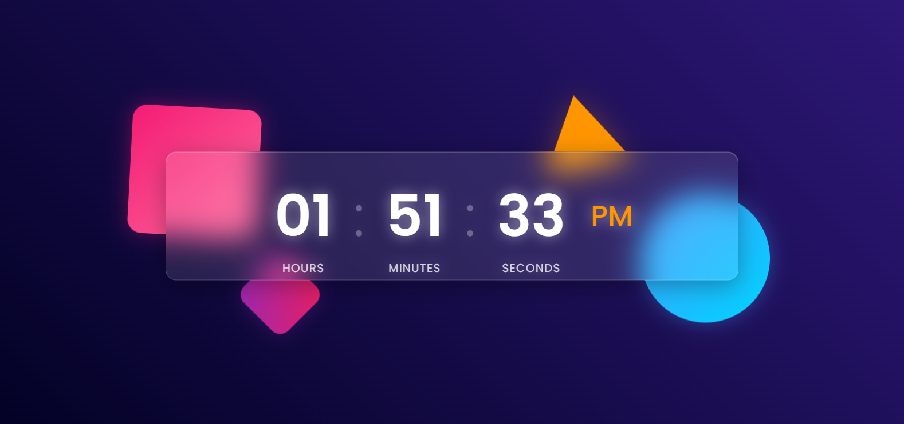

# Nassar's Animated Digital Clock

A beautifully designed, responsive, and animated digital clock built with pure HTML, CSS, and JavaScript. This project features a modern glassmorphism UI, subtle background animations, and a clean 12-hour time display. It's perfect for desktop displays, streaming overlays, or as a modern web widget.

---

## 📸 Screenshot



---

## 🚀 Live Demo

Check out the live version here: **[nassardigitalclock.netlify.app](https://nassardigitalclock.netlify.app/)**

---

## ✨ Features

-   **Modern UI:** Clean, modern interface with a sleek glassmorphism effect.
-   **12-Hour Format:** Displays time in a familiar 12-hour format (HH:MM:SS).
-   **AM/PM Indicator:** Clear AM/PM indicator that updates automatically.
-   **Real-Time Updates:** The clock updates every second without needing a page refresh.
-   **Subtle Animations:**
    -   Floating geometric shapes in the background.
    -   A blinking time separator for a classic digital feel.
    -   A soft "pulse" effect on some background elements.
-   **Fully Responsive:** The layout seamlessly adapts to look great on desktop, tablet, and mobile devices.
-   **SEO Optimized:** Includes comprehensive meta tags for search engines and beautiful link previews on social media (Open Graph & Twitter Cards).
-   **Lightweight:** Built with vanilla HTML, CSS, and JavaScript. No frameworks or libraries are needed.

---

## 🛠️ Tech Stack

-   **HTML5:** For the structure and content of the application.
-   **CSS3:** For styling, the glassmorphism effect, animations (`@keyframes`), and responsive design (`@media` queries).
-   **JavaScript (ES6):** For the core clock logic, DOM manipulation, and real-time updates (`setInterval`).

---

## 📂 File Structure

The project is organized with a clear and simple file structure:

```
/
├── index.html          # The main HTML file (the skeleton)
├── assets/
│   ├── css/
│   │   └── styles.css  # All styles, animations, and responsive rules
│   ├── scripts/
│   │   └── main.js     # The clock's logic and functionality
│   └── images/         # Favicons, social preview image, etc.
└── README.md           # This file
```

---

## 🚀 Getting Started

To run this project locally, follow these simple steps:

1.  **Clone the repository:**
    ```sh
    git clone https://github.com/your-username/nassar-digital-clock.git
    ```

2.  **Navigate to the project directory:**
    ```sh
    cd nassar-digital-clock
    ```

3.  **Open `index.html` in your browser:**
    You can simply double-click the `index.html` file or open it from your code editor.

That's it! No build process or dependencies are required.

---

## 🎨 Customization

It's easy to customize the look and feel of the clock:

-   **Colors:** Change the background gradient and the colors of the animated shapes by modifying the CSS variables or classes like `.hero`, `.container::before`, `.container::after`, `.triangle`, and `.diamond` in `assets/css/styles.css`.

-   **Fonts:** The project uses the 'Poppins' font from Google Fonts. You can change it by updating the `<link>` tag in `index.html` and the `font-family` property in `assets/css/styles.css`.

-   **Animations:** Tweak the speed, direction, or style of the animations by adjusting the `@keyframes` rules (`float1`, `float2`, `rotate`, `pulse`) in `assets/css/styles.css`.

---

## 📄 License

This project is licensed under the MIT License. See the [LICENSE](LICENSE) file for details.

---
